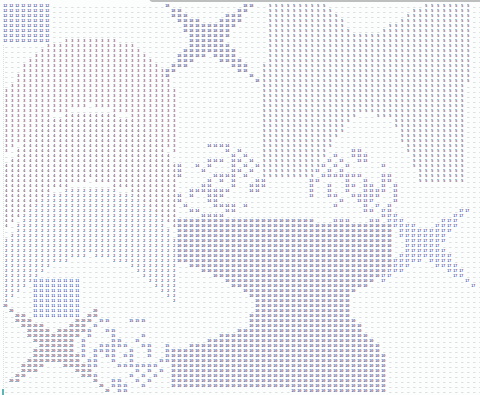

# About

This project devoted to the thesis project of Renat Valeev, BS18SB

Implements packer of 3D objects for printing.

With paths of ASCII STL models provided, this software is able to 
compactly arrange them in printer's bed, so you can save your time 
while printing large amount of models.

# STL file viewer

For the ease of checking model correctness, simple ASCII STL file viewer was implemented.
It based on OpenGL library.

## Compile

To compile the ASCII .STL(.stl) file reader and viewer run: `./viewer_all.sh`

## Run

`./viewer_all <ascii_stl_file>`

# Packer

Packer is written on C++ using only STL. Thus, in theory, it should be compilable in any system, on which C++ compiler can be run.
Based on genetic algorithm with tightness (how close objects situated) and overall covered area as core parts of fitness function.

Provide file with models paths (ex. [models_to_read.txt](models_to_read.txt)) as single argument for program and it will return the image of how models should be placed in a printer's bed compactly.

Also, the parameters to the program can be provided. They stored in [defaults](defaults)
```
0.05 <-- precision, size of cell in m
0.8 <-- size of printer's bed (assuming it is a square), in m
10 <-- mutation percentage
20 <-- initial population size
```

## Compile

`g++ -o packer packer.cpp`

## Run

`./packer models_to_read.txt`

# Example of output


Other examples can be seen in [this folder](images_for_readme).

Format of the file name: `<precision>_<printer's bed size>_<mutation percentage>_<initial population>_<count>.png`
